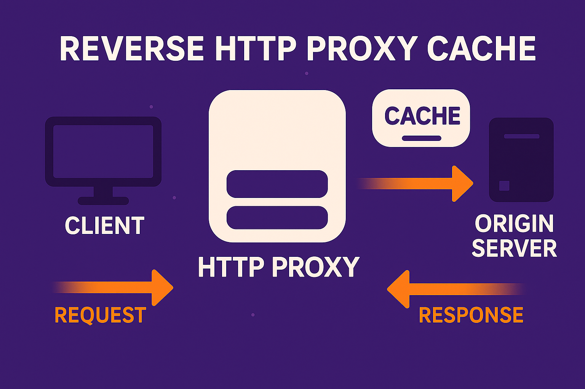

# Pimcore HTTP Cache Bundle

This bundle provides a simple way to handle cache invalidation for Pimcore elements. The Bundle relies on the `FOSHttpCacheBundle`, which is used to manage a reverse proxy HTTP cache.

## What is an HTTP Reverse Proxy?

An HTTP reverse proxy is a server that sits between your web application and the internet. Instead of serving content directly to clients, it forwards requests to the origin server (your web application) and caches the responses. When the same request comes again, it can serve the cached response directly, reducing load on your origin server and improving response times.

## What is FOS HTTP Cache Bundle?

The [`FOSHttpCacheBundle`](https://github.com/FriendsOfSymfony/FOSHttpCacheBundle/) is a Symfony bundle that helps manage HTTP caching using reverse proxies. It provides tools to:
- Invalidate cached content when data changes
- Configure cache headers
- Handle cache tags and variations
- Integrate with various reverse proxy solutions (like Varnish, Fastly, etc.)

## What does this Bundle do?

This bundle extends the functionality of `FOSHttpCacheBundle` specifically for Pimcore. It:
- Automatically handles cache invalidation for Pimcore elements (documents, assets, objects)
- Provides Pimcore-specific cache tags and variations
- Integrates seamlessly with Pimcore's event system
- Offers custom cache types for different use cases
- Allows for fine-grained control over caching behavior

In essence, this bundle makes it easy to implement efficient HTTP caching in your Pimcore application while maintaining proper cache invalidation when your content changes.

## Documentation

You will find the detailed documentation in the following links:
* [Installation](doc/1-installation.md)
* [Configuration](doc/2-configuration.md)
* [Pimcore elements](doc/3-pimcore-elements.md)
* [Events](doc/4-events.md)
* [Additional tags](doc/5-additional-tags.md)
* [Cancel caching behavior](doc/6-cancel-caching-behavior.md)
* [Custom cache types](doc/7-custom-cache-types.md)
* [Disabling caching behavior](doc/8-disable-caching-behavior.md)
* [Error handling](doc/9-error-handling.md)
* [Contribution](doc/10-contribution.md)

We hope you will enjoy this bundle as much as we do. If you have any questions or suggestions, please feel free to open an issue on GitHub.
This repository is maintained by [neusta](https://www.team-neusta.de/).

Happy caching!

